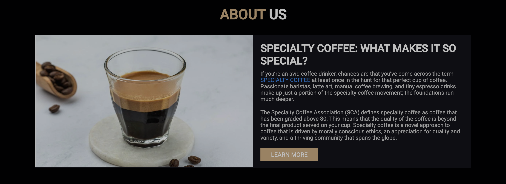
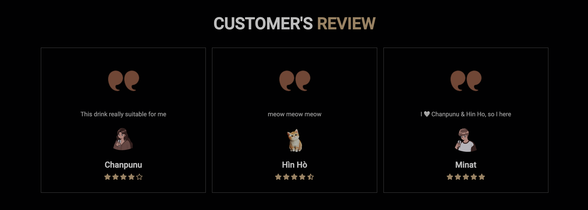
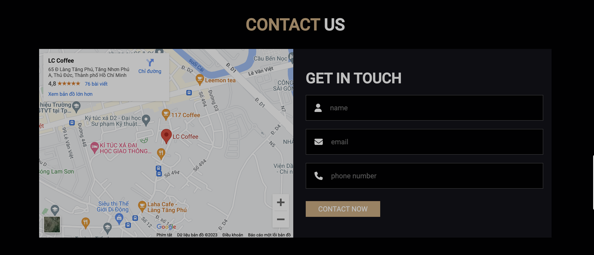

# Coffee Shop Website

This design belongs to [Mr. Web Designer](https://www.youtube.com/@MrWebDesignerAnas), you can see the video [here](https://youtu.be/52sKmRsk7xU)

## :writing_hand: Description
* The purpose of doing this web is to practice `HTML`, `CSS`, `JavaScript`, `Web Responsive`

## :computer: Technology
`HTML` `CSS` `JavaScript` 

## :camera_flash:	 Some preview images

### :round_pushpin: Links
- Solution URL: [Github](https://github.com/minatisleeping/Coffee-Shop)
- Live Site URL: [Github Page](https://minatisleeping.github.io/Coffee-Shop/)

## :heavy_check_mark:	 License & Copyright
&copy; 2023 Mai Minh Nhat minatisleeping Licensed under the [MIT LICENSE](https://github.com/minatisleeping/Coffee-Shop/blob/main/LICENSE).
